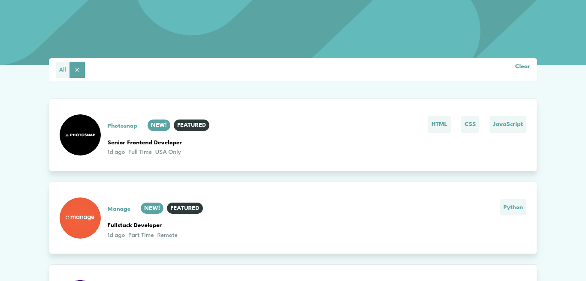
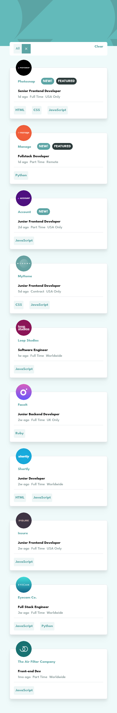

# Frontend Mentor - Job listings with filtering solution

Job listings with filtering built using Reactjs, tailwind and vite [Link to the challenge on Frontend Mentor](https://www.frontendmentor.io/challenges/job-listings-with-filtering-ivstIPCt). Frontend Mentor challenges help you improve your coding skills by building realistic projects. 

## Table of contents

- [Overview](#overview)
  - [The challenge](#the-challenge)
  - [Screenshot](#screenshot)
  - [Links](#links)
- [My process](#my-process)
  - [Built with](#built-with)
  - [Installation](#Installation)
- [Author](#author)

## Overview

### The challenge

Users should be able to:

- View the optimal layout for the site depending on their device's screen size
- See hover states for all interactive elements on the page
- Filter job listings based on the categories

### Screenshot

### Links

- Live Site URL: [live URL](https://jocular-muffin-d57f50.netlify.app/)

## My process

### Built with

- Semantic HTML5 markup
- CSS custom properties
- Flexbox
- Mobile-first workflow
- [React](https://reactjs.org/) - JS library
- Framer motion - React Animation framework
- [Tailwindcss](https://tailwindcss.com/docs/installation) - CSS Framework

### Installation
- Clone the project `git clone https://github.com/Clinton-dev/static-job-listing.git`
- Change into the director `cd static-job-listing`
- Install the dependencies required `npm install`
- Run the project `npm run dev`
- Head to the following url `http://localhost:5173/`

## Author

- Website - [Clinton wambugu](https://clintonwambugu-portfolio.herokuapp.com/)
- Frontend Mentor - [Clinton-dev](https://www.frontendmentor.io/profile/Clinton-dev)
- Twitter - [@WambuguClinton](https://twitter.com/WambuguClinton)
